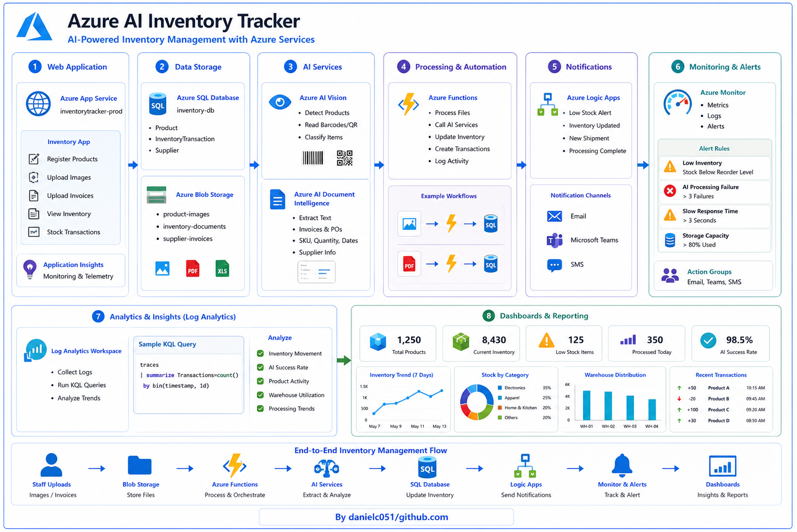

# 🤖 Azure AI Inventory Tracker

**Topics Covered:** Azure App Service, Azure AI Document Intelligence, Azure AI Vision, Azure Functions, Azure SQL Database, Azure Blob Storage, Azure Monitor, Application Insights, Azure Logic Apps, Azure Dashboards

**Certification Alignment:**
- AZ-104: Microsoft Azure Administrator
- AZ-204: Developing Solutions for Microsoft Azure
- AI-102: Designing and Implementing an Azure AI Solution

---

<p align="center">
  
</p>

---

## 📖 Summary

This project demonstrates how to build an AI-powered inventory management solution using Microsoft Azure. The application enables warehouse staff to upload inventory images, invoices, and product labels, while Azure AI services automatically identify products, extract relevant information, update inventory records, and generate operational insights.

Throughout the project, you will deploy an Azure Web App, integrate Azure AI Vision and Azure AI Document Intelligence, store inventory data in Azure SQL Database, automate inventory workflows using Azure Functions and Logic Apps, monitor application performance with Azure Monitor, and visualize inventory metrics through Azure Dashboards.

---

## 🏢 Scenario

A retail company manages inventory across multiple warehouses. Employees currently record stock levels manually using spreadsheets, leading to inconsistent inventory counts, delayed stock updates, and limited visibility into inventory trends.

Management requires a modern inventory solution that can:

- Automatically identify products from images
- Extract product information from invoices and shipping documents
- Track inventory levels in real time
- Notify staff when stock is low
- Monitor inventory movement
- Generate operational dashboards

The organization decides to implement an Azure AI Inventory Tracker.

---

# 🛠️ Steps

### 1️⃣ Deploy the Inventory Management Application

Create an Azure App Service to host the inventory tracking application.

Navigate to:

```text
Azure Portal
→ App Services
→ Create
```

Configure:

| Setting | Value |
|----------|---------|
| Resource Group | RG-INVENTORY |
| App Name | inventorytracker-prod |
| Region | Australia East |
| Runtime Stack | .NET 8 |
| Pricing Tier | B1 Basic |

Enable:

```text
Application Insights
```

Deploy an application that allows warehouse staff to:

- Register products
- Upload product images
- Upload invoices and purchase orders
- View inventory levels
- Manage stock transactions

Verify the application is accessible and telemetry is being collected.

---

### 2️⃣ Create the Inventory Database

Provision an Azure SQL Database.

Navigate to:

```text
Azure Portal
→ SQL Databases
→ Create
```

Create the following tables.

#### Product

```text
ProductID
ProductName
SKU
Category
Description
CurrentStock
ReorderLevel
```

#### InventoryTransaction

```text
TransactionID
ProductID
TransactionType
Quantity
Warehouse
TransactionDate
```

#### Supplier

```text
SupplierID
SupplierName
ContactEmail
Phone
```

Configure the application to securely connect to the database.

Verify inventory records can be created and updated.

---

### 3️⃣ Store Inventory Files

Create an Azure Storage Account.

Navigate to:

```text
Azure Portal
→ Storage Accounts
→ Create
```

Create Blob Containers:

```text
product-images
inventory-documents
supplier-invoices
```

Configure the application to upload:

- Product photographs
- Delivery receipts
- Purchase orders
- Inventory reports

Verify uploaded files are stored successfully.

---

### 4️⃣ Integrate Azure AI Services

Provision Azure AI Vision and Azure AI Document Intelligence.

Use Azure AI Vision to:

- Detect products in uploaded images
- Identify barcodes or QR codes
- Classify inventory items

Use Azure AI Document Intelligence to extract:

- Product names
- SKU numbers
- Invoice numbers
- Supplier information
- Purchase quantities
- Delivery dates

Automatically populate inventory records using the extracted information.

Validate AI results using several sample documents.

---

### 5️⃣ Automate Inventory Processing

Create Azure Functions to automate inventory workflows.

Functions should:

- Process uploaded files
- Call Azure AI services
- Update inventory quantities
- Create inventory transactions
- Flag missing information
- Log processing activity

Example workflow:

```text
Upload Image
        ↓
Azure Blob Storage
        ↓
Azure Function
        ↓
Azure AI Vision
        ↓
Update Inventory Database
```

Document processing workflow:

```text
Upload Invoice
        ↓
Blob Storage
        ↓
Azure Function
        ↓
Azure AI Document Intelligence
        ↓
Update Inventory
```

Verify inventory updates occur automatically.

---

### 6️⃣ Configure Notifications

Create an Azure Logic App.

Navigate to:

```text
Azure Portal
→ Logic Apps
→ Create
```

Create workflows for:

```text
Low Stock Alert
Inventory Updated
New Shipment Received
Document Processing Complete
```

Send notifications through:

```text
Email
Microsoft Teams
SMS
```

Validate all notification workflows.

---

### 7️⃣ Monitor the Solution

Use Application Insights and Azure Monitor.

Monitor:

- Request volume
- Function executions
- AI processing times
- Failed requests
- Blob Storage operations
- Database performance

Create alert rules for:

| Alert | Condition |
|---------|------------|
| Low Inventory | Stock Below Reorder Level |
| Failed AI Processing | >3 failures |
| Slow Application Response | >3 seconds |
| Storage Capacity | >80% Used |

Configure Action Groups for notifications.

Generate sample activity to verify alerts.

---

### 8️⃣ Analyze Inventory Data

Create a Log Analytics Workspace.

Navigate to:

```text
Azure Monitor
→ Log Analytics Workspace
→ Create
```

Run sample KQL queries.

Inventory transactions:

```kusto
traces
| summarize Transactions=count() by bin(timestamp, 1d)
```

Application requests:

```kusto
requests
| summarize Requests=count() by resultCode
```

Review:

- Inventory movement
- AI processing success rate
- Product activity
- Warehouse utilization
- Processing trends

---

### 9️⃣ Build an Inventory Dashboard

Create an Azure Dashboard displaying:

#### KPIs

```text
Total Products
Current Inventory
Low Stock Items
Products Processed Today
AI Processing Success Rate
```

#### Visualizations

```text
Inventory Trend
Stock by Category
Warehouse Distribution
Low Inventory List
Daily Transactions
AI Processing Activity
```

Pin charts from:

- Azure Monitor
- Application Insights
- Azure SQL Database
- Log Analytics

Optionally connect Power BI for advanced inventory analytics.

Validate dashboard updates as inventory changes.

---

## 🎯 Learning Outcomes

By completing this project, you will be able to:

- Deploy Azure App Services
- Configure Azure SQL Database
- Store files in Azure Blob Storage
- Integrate Azure AI Vision
- Implement Azure AI Document Intelligence
- Automate workflows using Azure Functions
- Build Logic App workflows
- Monitor applications with Azure Monitor
- Analyze telemetry using KQL
- Create Azure Dashboards
- Design AI-powered inventory management solutions

---

## 🚀 Business Benefits

- Automated inventory tracking
- Reduced manual data entry
- Faster inventory processing
- Improved stock accuracy
- Real-time inventory visibility
- Automated low-stock notifications
- AI-assisted document processing
- Better operational decision-making
- Scalable cloud-native inventory management